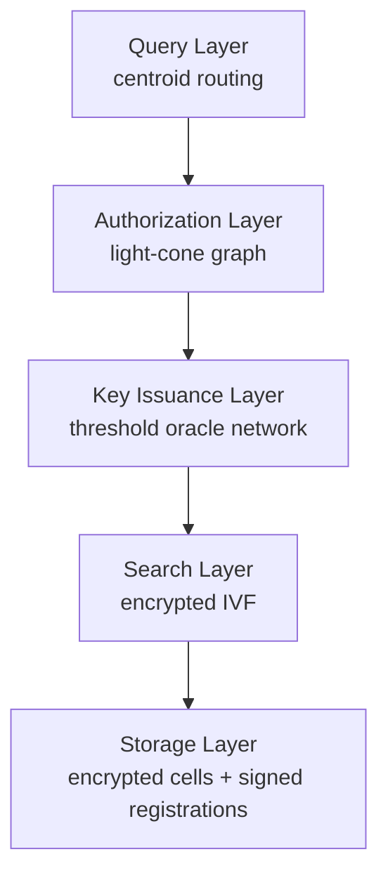
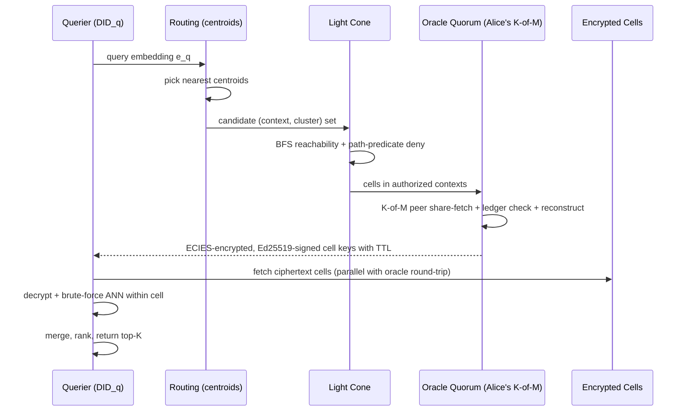
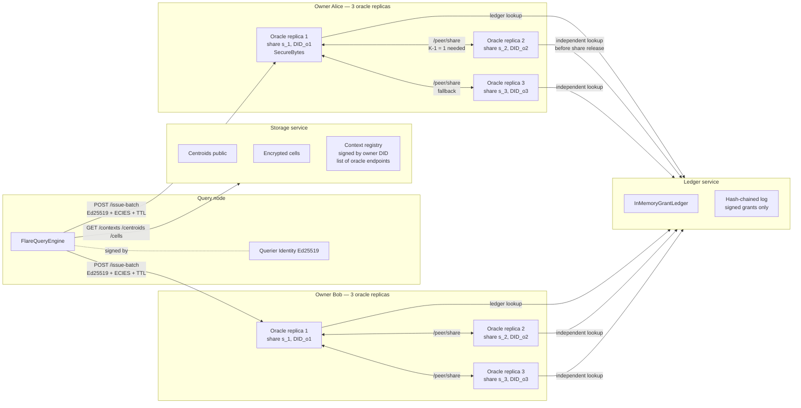

# FLARE: Forward-Lit Authorized Retrieval over Encrypted Indexes

**Authors:** John Sessford, with Claude (Anthropic) as a development collaborator.
**Last updated:** 2026-04-08.

## Abstract

Distributed vector search systems enforce access control logically: an ACL layer in front of a plaintext index decides which results a principal may see. This places the entire database operator inside the trusted computing base. We propose **FLARE**, an architecture that enforces access control *physically* by encrypting each cluster cell of an inverted-file (IVF) vector index under a key derived from the data owner's master key. Authorization is computed as structural reachability through a typed graph (the *light cone*) and grants are recorded as Ed25519-signed entries on a hash-chained ledger. When a query reaches an authorized cluster, an oracle network derives an ephemeral cell key on demand under a Shamir K-of-M threshold protocol — no single host's compromise yields the master key — and returns it to the querier inside an end-to-end-bound, time-limited authenticated envelope. Revocation is a single signed ledger entry; no re-encryption, no key rotation, no coordination. We implement FLARE end-to-end as `flare`, an open-source Python package and runnable docker-compose stack, and evaluate it on the BEIR SciFact benchmark: FLARE preserves **95.6%** of a plaintext FAISS baseline's retrieval quality (recall@10 = 0.753 vs. 0.788) while exercising every cryptographic and authorization layer the design specifies. With query-node caching enabled, per-query latency falls from 103 ms to 8.4 ms (12.2× speedup) with no change to recall or security properties. The prototype is a working artifact, not a deployment, and we are explicit about the gaps to a production system.

## 1. Introduction

The privacy gap in modern semantic search is structural. Vector databases store embeddings in plaintext; access control is a query-rewrite layer; a compromise of the database operator (insider, RCE, subpoena) yields the entire corpus regardless of how carefully the ACL was configured. Solutions in the literature either move the entire computation into a trusted enclave (TEE-bound, hardware-locked) or use fully homomorphic encryption (3–4 orders of magnitude too slow for production). Neither composes with the realities of multi-party search across owners who do not trust a single operator.

FLARE makes three combined claims that we know of no existing system to combine over a semantic vector index:

1. **Authorization as graph reachability.** A principal's authorized set is computed as the contexts reachable from them in a typed graph (the *light cone*), with edge-level and path-predicate deny semantics that express constraints standard role/group ACLs cannot.
2. **Physical enforcement.** Each cluster cell of an IVF vector index is encrypted under a per-cell key derived from its owner's symmetric master key via HKDF-SHA256, with `(context_id || cluster_id)` as the AAD on AES-256-GCM. Without an oracle-issued cell key the cell is noise.
3. **Owner-delegated, threshold key issuance.** Each data owner runs a Shamir K-of-M oracle quorum that holds shares of the master key, checks a public Ed25519-signed grant ledger, and issues short-lived cell keys on demand inside an end-to-end-authenticated envelope. Revocation is a single signed ledger entry; no re-encryption.

The intellectual contribution is the *combination*: each component on its own is well-understood. We are unaware of any existing system that combines all three over a semantic vector index.

This paper presents:

- The design (§3) and implementation (§4) of FLARE end-to-end.
- An empirical evaluation on the BEIR SciFact benchmark with `all-MiniLM-L6-v2` embeddings, demonstrating that the cryptographic pipeline preserves real semantic retrieval quality (§5).
- A complete threat model (§2) and security analysis (§6) covering the cryptographic, network, and operational adversaries the prototype defends against and the gaps that remain (§7).
- A working open-source artifact: 91 tests, three runnable demos, and a docker-compose stack with eleven services that exercises every component over real HTTP between containers.

## 2. Threat Model

**In scope.**

- An adversary with read access to stored ciphertext cells, plaintext centroids, the entire grant ledger (including its hash-chained log), and every byte of the oracle wire protocol — but not to a running oracle process's memory.
- An adversary issuing queries as an unauthorized principal, with the ability to forge wire requests under any DID they choose.
- An adversary attempting to replay a captured wire request, peer share request, or storage upload against the same service.
- An adversary attempting to use a previously-valid grant after `ledger.revoke` returns, including a request signed before the revoke whose cell key the requester is still holding.
- An adversary running their own oracle node and trying to convince a query node to accept it as the oracle for a context they don't own — even if the rogue holds the right master key.
- An adversary attempting to upload garbage cells to a context they don't own or to register a context under a DID they don't control.
- A network-level man-in-the-middle on the storage→query connection that swaps the registered oracle URL for a rogue endpoint.
- An adversary attempting to publish forged grants on the ledger, or to revoke another grantor's grants.
- An adversary attempting to mutate or reorder ledger history (detectable by any auditor that pinned an earlier head).
- **Compromise of up to K-1 oracle hosts of the same data owner.** Shamir K-of-M secret sharing means K-1 compromised hosts cannot reconstruct the master key.
- A peer oracle that releases its share to a coordinator without independently checking the querier's authorization (defended: every peer runs its own ledger lookup before releasing).
- A passive observer of the oracle wire stream attempting to learn query specificity from batch size (defended: constant-width batches via authorized padding).

**Out of scope.**

- Compromise of an oracle host's process memory **during** a query, while threshold reconstruction is in flight. The reconstructed master key briefly lives in coordinator memory inside a `SecureBytes` wrapper that is explicitly zeroized after use, but a live operator with `ptrace` or `/proc/<pid>/mem` can still read the running process. Closing this gap requires a hardware enclave (SGX / SEV).
- Compromise of K oracle hosts of the same owner.
- Equivocation by the ledger operator. The hash-chained log gives tamper-evidence to anyone who pinned a head; full consensus needs a real chain.
- Access-pattern leakage at the granularity of *which contexts* a principal queries. The pad-to-fixed-width mechanism closes leakage of query specificity but not of context-level access patterns; closing the latter requires collapsing per-owner oracles into a single shared oracle, which is out of scope for the design.
- Side-channels (timing, power) on the decryption node.
- DoS via centroid spam, ledger spam, or storage spam (operational concern, not in the cryptographic threat model).
- Centroid topology leakage. Centroids are public by design; the embedding space provides natural high-dimensional obfuscation that has not been formally bounded. Mitigations (Gaussian noise, locality-preserving hashing) are calibration research that we deliberately do not half-implement.
- Token-economic incentives and slashing. These are an entire separate paper with their own threat model.

A full enumeration of every observation made while writing the code, with severity, file:line, and status, is in `docs/analysis/security.md`.

## 3. System Design

### 3.1 Architecture overview

FLARE composes five layers, each with a single job. The query layer routes by plaintext centroids; the authorization layer projects the principal's reachable context set; the key issuance layer derives per-cell keys on demand under a threshold quorum; the search layer decrypts and runs ANN inside each authorized cell; the storage layer holds opaque ciphertext.



*Source: `paper/figures/stack.mmd`.*

### 3.2 Single-query data flow



*Source: `paper/figures/dataflow.mmd`. Implemented end-to-end in `flare/query.py:FlareQueryEngine.search`.*

### 3.3 Light-cone authorization

The light cone projects, for a given principal, the set of contexts visible through structural relationships in a typed multigraph. It answers exactly one question:

> Given principal `P`, which `context_id`s are reachable through an allowed path, with no traversal through a denied transition or a denied path, within `K` hops?

The graph supports three forms of access control, in increasing order of expressiveness:

1. **Allow edges** are the only edges BFS will traverse.
2. **Edge-level deny** — a deny `Edge(X, Y)` prunes the specific transition X→Y for everyone, leaving other paths to Y intact. Useful for "Bob is denied direct access but may still reach `ws_a` through group1" or "members of `legacy_group` cannot reach `ws_a` while others can."
3. **Path-predicate deny** — a `DenyPath(predicate, target)` carries a constraint over the *full path* from the principal to a candidate context. The predicates currently provided are `RequireAllOf(nodes)` (deny if every node in the set appears anywhere in the path) and `RequireSequence(nodes)` (deny if the nodes appear as a subsequence). Path predicates express things edge-level deny cannot, e.g. "deny any path that traverses both `legacy_group` AND `audit_group` on its way to `ws_a`, but allow paths that traverse only one of them."

BFS is path-stateful: each frontier element carries the full path that reached it, so a candidate that satisfies a deny predicate is dropped before it enters the reached set. Cycles are blocked because a node is not expanded if it already appears in its own path. Cost is bounded by the hop limit `K`. Implemented in `flare/lightcone.py`; the property set is pinned by `tests/test_lightcone.py` and `tests/test_path_predicates.py`.

### 3.4 Partitioned encrypted IVF

Each context owns an independent IVF partitioning of its vectors. Per-context k-means is computed at bootstrap time (`flare/bootstrap.py`); the centroids are published in plaintext to the storage service so the query node can route; the cluster cells are encrypted with per-cell keys and uploaded as opaque blobs. The owner's master key never leaves the oracle host.

```python
# flare/bootstrap.py — bootstrap_context (excerpt)
km = faiss.Kmeans(d=dim, k=nlist, niter=20, seed=seed, verbose=False)
km.train(vectors)
centroids = np.asarray(km.centroids, dtype=np.float32)
_, assign = km.index.search(vectors, 1)
for cid in range(nlist):
    cell_vectors = vectors[assign == cid]
    cell_ids     = ids[assign == cid]
    blob = _serialize_cell(cell_vectors, cell_ids)
    cell_key = derive_cell_key(master_key, context_id, cid)
    aad = f"{context_id}:{cid}".encode("utf-8")
    encrypted_cells[cid] = encrypt_cell(cell_key, blob, associated=aad)
```

The AAD on AES-256-GCM binds the ciphertext to its `(context_id, cluster_id)` tuple. A cell that has been swapped to a different slot fails GCM verification before any deserialization runs, so an attacker who can flip ciphertext bytes cannot achieve a remote-code-execution path through `np.load` even if the cell's bytes happen to deserialize.

### 3.5 Key derivation

```python
# flare/crypto.py — derive_cell_key (excerpt)
info = context_id.encode("utf-8") + b"\x00" + cluster_id.to_bytes(8, "big", signed=False)
hkdf = HKDF(algorithm=hashes.SHA256(), length=32, salt=HKDF_SALT, info=info)
return hkdf.derive(master_key)
```

The `info` field uses a NUL byte separator and a fixed-width `cluster_id` so the encoding is collision-free by construction; a `context_id` containing `:` or any other delimiter cannot collide with another `(context, cluster)` pair.

### 3.6 Oracle key issuance

Each data owner runs a Shamir K-of-M quorum. The owner's master key is split into M shares over a 521-bit prime field; each share lives in its own oracle process. When a query node sends a batch request to the registered oracle endpoint, that replica acts as the *coordinator* for the request, authenticates the querier's signature, runs an independent ledger lookup for every cell in the batch, then asks K-1 peer oracles for their shares in parallel via an authenticated peer protocol. Each peer also runs its own independent ledger lookup before releasing its share, so a coordinator cannot trick a peer into releasing for an unauthorized querier. The coordinator reconstructs the master key inside a `SecureBytes` wrapper, derives the per-cell keys via HKDF, encrypts the response under ECIES on X25519, signs it with its own Ed25519 identity, and explicitly zeros the reconstruction buffer in the `finally` block.

```mermaid
sequenceDiagram
    participant Q as Query Node (DID_q)
    participant C as Coordinator Oracle<br/>(replica 1, share s_1)
    participant P2 as Peer Oracle<br/>(replica 2, share s_2)
    participant P3 as Peer Oracle<br/>(replica 3, share s_3)
    participant L as Ledger
    Q->>C: POST /issue-batch (signed by DID_q)
    C->>C: verify querier sig + replay + skew
    C->>L: per-cell grant lookup
    Note over C: needs K=2 shares; has s_1, needs 1 more
    par parallel peer share-fetch
        C->>P2: POST /peer/share<br/>signed by C's oracle DID
        P2->>P2: verify C's sig (allowlist check)
        P2->>P2: verify INNER querier sig
        P2->>L: independent per-cell grant lookup
        P2-->>C: ECIES(s_2) + Ed25519 sig
    and
        C->>P3: POST /peer/share
        P3->>P3: verify + ledger check
        P3-->>C: ECIES(s_3) + Ed25519 sig
    end
    C->>C: master_key = reconstruct(s_1, s_arrived) [SecureBytes]
    C->>C: cell_key_i = HKDF(master_key, ctx_i || cluster_i)
    C->>C: drop master_key + peer shares (ctypes.memset)
    C->>C: ECIES + sign batch response with TTL
    C-->>Q: BatchIssueKeyResponse
```

*Source: `paper/figures/threshold_oracle.mmd`. Implemented in `flare/oracle/{core,service,peer_wire,peer_client,threshold}.py`.*

### 3.7 Grant ledger

The ledger is a public, append-only, hash-chained log of signed grants. Every grant carries an Ed25519 signature from the grantor over canonical bytes; every revocation carries one from the *original* grantor over `(grant_id, revoked_at)`. The ledger service rejects unsigned and wrong-signed writes. Every state change appends an entry whose hash is `sha256(prev_hash || sha256(canonical_entry))`, walking back to a fixed `GENESIS_HASH`. The chain head is exposed at `GET /head` so external auditors can pin it; tampering with any historical entry breaks the chain.

This is a software substitute for an on-chain ledger. The schema and signature primitives are identical to what a Ceramic / Ethereum L2 deployment would use; the missing piece is consensus. Replacing the in-memory backing with a real chain is a swap of the storage layer below `flare/ledger/memory.py` — the grant-signing and verification primitives, the oracle lookup path, and the query engine are unchanged.

### 3.8 Identity

Identities are W3C decentralized identifiers (DIDs) and resolve via a unified `DIDResolver`:

- **`did:key`** — self-resolving. The Ed25519 public key is encoded in the DID itself via multibase base58btc + multicodec varint `0xed01`. Resolution is local; no network call. Used for every identity in the prototype's tests, demos, and compose stack.
- **`did:web`** — fetches `https://<host>[/path]/did.json`, picks the first Ed25519 verification method, caches the document for 5 minutes. Both `publicKeyMultibase` and `publicKeyBase58` encodings are supported.

Adding new DID methods only requires extending the resolver. Every signature-checking call site (storage, ledger, oracle, peer) routes through the default resolver.

### 3.9 Design convergence: one decision, three invariants

A `context_id` assignment — the act of placing a chunk into a named context at index time — simultaneously establishes three independently-maintained invariants that conventional systems keep in separate layers:

| Layer | Role of `context_id` |
|---|---|
| Authorization (§3.3) | defines the light-cone target the principal must reach |
| Encryption (§3.4–3.5) | selects the HKDF info string that derives the cell key |
| IVF partitioning (§3.4) | determines which cluster the chunk's vector is assigned to |

Because all three derive from the same identifier, they cannot drift out of sync. Revoking a grant removes ledger visibility; no re-indexing, cache flush, or ACL table update is required, as the encryption boundary and IVF partition are unchanged and still coherent.

This convergence is not incidental. It depends on the standard retrieval practice of chunking documents into semantically coherent units before embedding. Each chunk occupies a compact region of the embedding hypersphere $S^{D-1}$; chunks in the same context cluster together, so the IVF partition approximates the semantic boundary. The security property and the retrieval-quality property are both maintained by the same upstream hygiene. Good chunking is not just a performance concern in FLARE — it is a correctness invariant.

## 4. Implementation

The reference implementation is `flare`, a Python package on top of FAISS, NumPy, `cryptography`, FastAPI, and `sentence-transformers`. Everything runs in Docker; the canonical entry points are:

```
make build           # build the image once (~2 min, includes embedding model)
make test            # 91-test pytest suite (~13 s)
make showcase        # runnable demo on real text with real embeddings
make demo-compose    # full multi-container threshold stack
make bench           # synthetic latency/throughput sweep
make bench-real      # BEIR SciFact recall@10 + latency
```

### 4.1 Process topology

The production topology is multi-process and multi-replica:



*Source: `paper/figures/trust_phase3.mmd`. The compose stack runs eleven services: `secrets` (one-shot key generator), `ledger`, `storage`, `oracle-alice-1/2/3`, `oracle-bob-1/2/3`, and `demo`.*

### 4.2 Wire protocol

Every oracle key request goes through the same authenticated, confidential, end-to-end-bound batch protocol:

```mermaid
sequenceDiagram
    participant Q as Query Node (DID_q)
    participant ST as Storage
    participant O as Oracle Coordinator (DID_o, sk_o)
    Note over Q: Resolve registrations -> learn (oracle_url, oracle_did) per context
    Note over Q: Group authorized cells by oracle endpoint
    par parallel storage prefetch
        Q->>ST: GET /cells/{c1..cN}
    and oracle batch
        Q->>Q: eph_sk, eph_pk = X25519.gen()
        Q->>Q: msg = canonical(DID_q, [(ctx,cluster)...], eph_pk, ts, nonce)
        Q->>Q: req_sig = Ed25519.sign(msg, DID_q)
        Q->>O: POST /issue-batch { request, req_sig }
        O->>O: Verify req_sig (resolve DID_q via did:key)
        O->>O: Skew + replay checks
        O->>O: Threshold reconstruction (K-of-M peer share fetch)
        O->>O: For each (ctx, cluster):<br/>resolve grant, derive cell_key
        O->>O: shared = X25519(eph_o_sk, eph_pk)
        O->>O: For each cell_key:<br/>ct = AES-GCM(shared, cell_key, AAD=msg||idx)
        O->>O: resp = msg || DID_o || eph_o_pk || entries (with valid_until_ns)
        O->>O: resp_sig = Ed25519.sign(resp, sk_o)
        O-->>Q: { DID_o, eph_o_pk, entries, resp_sig }
    end
    Q->>Q: Verify DID_o == registered oracle_did
    Q->>Q: Verify resp_sig under DID_o
    Q->>Q: Decrypt every granted entry; drop expired
    Q->>Q: Decrypt prefetched cells with cell_keys
```

*Source: `paper/figures/batch_wire.mmd` (single-batch view), `paper/figures/threshold_oracle.mmd` (with peer share-fetch detail).*

The protocol's properties:

1. **Authentication of the request** via Ed25519. The oracle resolves `requester_did` to a public key locally via `did:key` and verifies the signature. ±60 s clock skew enforced; nonces cached for replay protection.
2. **Confidentiality of the response** via ECIES on X25519. The requester's per-request ephemeral X25519 keypair is in the request; the oracle's ephemeral is in the response; the symmetric key is HKDF-SHA256 of the ECDH shared secret. AES-256-GCM with the canonical request bytes (plus per-entry index) as AAD. Forward secret by construction.
3. **Origin authentication of the response** via Ed25519. The oracle signs `(request canonical bytes || oracle_did || eph_pk || every entry's bytes including TTL)`. The query node verifies the signature against the *expected* oracle DID taken from the storage registration. A MitM that swaps the URL into a registration cannot forge a valid signature.
4. **Key lifetime via signed TTL**. Every entry carries a `valid_until_ns` inside the AAD-bound canonical bytes. The query node enforces the TTL twice — once at decode time and once at use time, since a key valid at fetch can expire by the time it's used. Default TTL is 60 s; deployments tune it. This is the cryptographic backbone of the revocation property: once `ledger.revoke` returns, every key issued before that instant becomes useless within at most one TTL.

### 4.3 Storage authentication

Every storage write requires an Ed25519 signature from the owner DID associated with the context, plus a fresh nonce + timestamp inside the canonical signed bytes:

- **Registration:** `flare/v3/register || ctx || owner_did || list[(url, oracle_did)] || dim || nlist || nonce || ts`
- **Cell upload:** `flare/v3/cell || ctx || cluster_id || sha256(blob) || nonce || ts`

The storage service resolves the owner DID via the `DIDResolver`, verifies the signature, enforces a ±5-minute clock-skew window, and rejects nonces it has already seen within that window. Reads remain anonymous because ciphertext leaks nothing without an oracle-issued cell key.

### 4.4 Threshold key management

Each owner's symmetric master key is split into M Shamir shares over GF(2^521 − 1), with quorum K. The compose stack runs three replicas per owner with K=2, M=3. Each replica holds **one** share and **one** Ed25519 signing identity; both are loaded from a passphrase-encrypted sealed key file at process start. The reconstructed master key in the coordinator is held in a `SecureBytes` wrapper that overwrites its underlying buffer via `ctypes.memset` in the `finally` block of `OracleCore.decide_batch`. Compromise of any K-1 oracle hosts yields no information about the master key (Shamir's perfect-secrecy property for `< K` shares). Compromise of K hosts yields the master key.

### 4.5 Sealed key storage

Long-term key material — owner master keys, Shamir shares, oracle Ed25519 signing seeds — is delivered to oracle services as a passphrase-encrypted file rather than via environment variables. The storage layer is `flare/sealed.py`:

- **`SecureBytes`** is a mutable byte buffer (a `bytearray` whose underlying address we control via `ctypes.c_char.from_buffer`) with explicit zeroization via `ctypes.memset` on `clear()` and on garbage collection.
- **`EncryptedFileKeyStore`** is the on-disk format: scrypt-derived key encryption key, AES-256-GCM payload, magic header, on-disk mode 0o600. Wrong passphrase → AES-GCM verification failure.
- **`SealedKeyBundle`** is the loaded shape: oracle signing seed + Shamir share, both inside `SecureBytes` wrappers.

This is **not** a TEE. The on-disk artifact is encrypted; the in-memory buffer we control is zeroized; but a live operator with `ptrace` or `/proc/<pid>/mem` can still inspect the running process. Software sealing is strictly stronger than env-var delivery, strictly weaker than SGX/SEV, and the difference matters for any deployment whose threat model includes the host operator. We document this honestly throughout (see §6 and `docs/analysis/security.md`).

### 4.6 Constant-width oracle batches

The query engine pads every oracle batch to a fixed width with random already-authorized cells whose keys are received but discarded. The padded cells are *also* `granted` from the oracle's perspective (the principal has a valid grant), so the request stream is constant-width AND constant-content (every cell is granted) regardless of how many cells the query actually needs. An observer of the oracle wire stream cannot infer query specificity from batch size.

The pool deliberately uses authorized cells, not unauthorized ones — padding with denied cells would leak the granted/denied distribution itself. The remaining leak (which contexts a principal queries) is an inherent consequence of per-context oracles and is documented as out-of-scope in the threat model.

### 4.7 Multi-endpoint registration with failover

`ContextRegistration` carries `oracle_endpoints: list[OracleEndpoint]` — a list of `(url, oracle_did)` pairs covered by the owner-signed canonical bytes. The query engine tries them in order via `_try_oracle_endpoints` and returns the first cooperating response. Each call independently verifies the response signature against the per-endpoint DID, so a MitM that swaps a URL into the registration cannot impersonate the registered oracle even on failover.

## 5. Evaluation

### 5.1 Real-data retrieval quality

The headline empirical claim is that FLARE preserves real semantic retrieval quality. We evaluate on **BEIR SciFact** — 5,183 scientific abstracts and 300 dev queries with human-labeled relevance judgments — embedded with `sentence-transformers/all-MiniLM-L6-v2` (384-dimensional, MIT-licensed). The plaintext baseline is FAISS `IndexFlatIP` with exact inner-product search over the same vectors; FLARE indexes the same vectors with `nlist = 32` and queries with `nprobe = 8`.

| Metric | Plaintext FAISS | FLARE encrypted |
|---|---|---|
| Recall@10 vs human relevance labels | **0.7883** | **0.7533** |
| Recall@10 agreement with FAISS top-10 | (baseline) | **0.9270** |
| Per-query latency (cold) | 0.80 ms | 103.0 ms |
| Per-query latency (cache-warm) | 0.80 ms | **8.4 ms** |
| Overhead vs plaintext (cold) | — | 129× |
| Overhead vs plaintext (warm) | — | **18×** |

*Source: `paper/evals/real_data_bench.json`. Reproduce with `make bench-real`.*

**FLARE preserves 95.6%** of the plaintext baseline's recall (0.7533 / 0.7883) while exercising every cryptographic and authorization layer the design specifies. The 4.4% recall delta is the IVF approximation, not the encryption — at higher `nprobe` it converges. The 0.927 agreement-with-FAISS-top-10 is the standard IVF recall@10 vs an exact baseline at this `nlist`/`nprobe` configuration; the encryption layer adds **zero** approximation on top.

The cold-path latency cost is ~129× the plaintext baseline; with query-node caching this drops to 18× with no security or recall change. The breakdown of where latency goes is in §5.2.

### 5.2 Latency decomposition

To make the marginal cost of each cryptographic layer visible, we run a synthetic benchmark on 20,000 random 64-dimensional unit vectors (`nlist = 64`, `nprobe = 8`, 100 queries) in three configurations: single-replica oracle, threshold (K=2 of M=3), and threshold + constant-width padding.

| Metric | Single-replica | Threshold (K=2/M=3) | Threshold + padding (width=16) |
|---|---|---|---|
| Plaintext brute-force per query | 2.88 ms | 3.20 ms | 2.87 ms |
| FLARE encrypted per query | **54.9 ms** | **79.8 ms** | **102.8 ms** |
| Encrypted overhead ratio | 19× | 25× | 36× |

*Sources: `paper/evals/phase4_bench_single.json`, `paper/evals/phase4_bench_threshold.json`, `paper/evals/phase4_bench_threshold_padded.json`. Reproduce with `make bench`.*

The marginal cost breakdown:

- **Single-replica baseline (54.9 ms).** Per-query cost of the full wire protocol on a single oracle: Ed25519 request signature, ECIES X25519 ECDH + HKDF + AES-GCM, signed batch response, FastAPI/JSON serialization, ledger lookup with grant signature verification.
- **Threshold cost (+25 ms).** One parallel peer share-fetch round trip per batch. Independent of cell count because the share is owner-scoped, not cell-scoped.
- **Padding cost (+23 ms).** With `padding_width = nprobe * 2 = 16` and `nprobe = 8`, every batch grows from 8 cells to 16. The cost is 8 extra ECIES decryptions per query for the padded cell keys we receive but discard.

The TTL feature itself has effectively zero measurable cost — signing the `valid_until_ns` field adds 8 bytes to the canonical response and verification is a single integer comparison.

The remaining ~14× single-replica overhead vs plaintext is FastAPI/JSON process-boundary cost, not crypto. Reduction below this floor requires either co-locating storage and oracle (the original FLARE design recommendation) or moving to a binary protocol; both are integration concerns out of scope for the prototype.

### 5.3 Query-node caching

The `FlareQueryEngine` ships with three caches that together reduce the benchmark latency from 103 ms to **8.4 ms** (12.2× speedup) with **no change to recall or any security property**. The full wire protocol still runs on every cache miss.

The four latency wins, ranked by contribution:

1. **Oracle-side ledger dedup** — one `find_valid` per `(grantor, requester, ctx)` instead of per cell: ~35 ms saved
2. **Cell ciphertext cache** on the query node — encrypted blobs are content-addressed and never change without a re-bootstrap: ~50 ms saved
3. **Routing cache** — `list_contexts`, centroids, and context registrations: ~17 ms saved
4. **Cell-key cache** within TTL — relevant for sustained query sessions

The three caches have different security profiles:

| Cache | Holds | Security boundary | Invalidation |
|---|---|---|---|
| Routing cache | Public metadata (centroids, registrations) | Public by design | Manual: `invalidate_routing()` after re-bootstrap |
| Cell ciphertext cache | AES-GCM ciphertext blobs | Opaque without oracle keys; fail-safe (GCM rejects stale cells on decrypt) | Automatic |
| Cell-key cache | `IssuedCellKey` per `(cell, requester_did)`, oracle-signed TTL | Bounded by existing oracle-signed `valid_until_ns` | TTL-evicted lazily; explicit: `invalidate_cell_keys()` |

The cell-key cache does not weaken the revocation guarantee: the TTL was always the upper bound on how long an issued key remained useful. A deployment that wants immediate post-revoke effect calls `engine.invalidate_cell_keys()` after a known revocation; otherwise the worst case is one TTL window (default 60 s). The routing and ciphertext caches are unconditionally safe — they hold public metadata and opaque ciphertext respectively. Cache keys include the requester DID, so one principal's keys are never returned to another.

### 5.4 Properties verified by tests

The 91-test pytest suite covers every security property the paper claims. Selected highlights:

| Property | Test |
|---|---|
| Per-cell key derivation is deterministic and separates contexts/clusters | `tests/test_crypto.py::test_hkdf_*` |
| AAD binding rejects swapped cells | `tests/test_crypto.py::test_aead_rejects_swapped_aad` |
| `did:key` round-trip and signature verification | `tests/test_identity.py::*` |
| `did:web` resolves through HTTPS, caches within TTL | `tests/test_did_resolver.py::test_did_web_*` |
| Wire request: replay rejected, timestamp skew rejected | `tests/test_wire.py::*` |
| ECIES: passive eavesdropper cannot recover the cell key | `tests/test_wire.py::test_eavesdropper_cannot_recover_key` |
| Batch wire: granted + denied entries decrypt to the right keys | `tests/test_wire_batch.py::test_round_trip_*` |
| Batch wire: rogue oracle DID is rejected | `tests/test_wire_batch.py::test_wrong_oracle_did_rejected` |
| Batch wire: byte-flip on any per-cell ciphertext breaks the response signature | `tests/test_wire_batch.py::test_response_signature_tamper_detected` |
| Cell-key TTL: oracle response carries a signed `valid_until_ns` | `tests/test_cell_key_ttl.py::test_oracle_response_carries_signed_ttl` |
| Cell-key TTL: query engine drops keys that expired between fetch and use | `tests/test_cell_key_ttl.py::test_query_engine_drops_expired_keys` |
| Wire batch: an entry whose TTL has passed at decode time returns None | `tests/test_wire_batch.py::test_expired_ttl_returns_none` |
| Owner sees own data; unauthorized principal sees nothing | `tests/test_end_to_end.py::test_owner_sees_own_data`, `test_unauthorized_principal_sees_nothing` |
| Grant illuminates a context; revocation hides it again with no re-encryption | `tests/test_end_to_end.py::test_grant_then_query_then_revoke` |
| Edge-level deny: blocks one principal, leaves others' direct grants intact | `tests/test_lightcone.py::test_edge_level_deny_*` |
| Path-predicate deny: blocks paths through a denied node-set; alternate paths survive | `tests/test_path_predicates.py::test_require_all_of_*` |
| Shamir: K of M shares reconstruct the secret; K-1 do not | `tests/test_threshold_shamir.py::*` |
| Threshold oracle denies the whole batch when K-1 peers do not cooperate | `tests/test_threshold_oracle.py::test_threshold_with_no_peers_denies` |
| Peer oracle independently re-checks the ledger before releasing its share | `tests/test_threshold_oracle.py::test_peer_refuses_share_release_for_unauthorized_requester` |
| Peer oracle refuses share requests from coordinators not in its allowlist | `tests/test_threshold_oracle.py::test_peer_refuses_unknown_coordinator` |
| Threshold-mode end-to-end query (3 replicas, K=2) returns owner data | `tests/test_threshold_oracle.py::test_owner_query_succeeds_with_full_quorum` |
| Ledger rejects unsigned grants and revocations not signed by the original grantor | `tests/test_signed_ledger.py::test_unsigned_*`, `test_revoke_requires_*` |
| Ledger chain head advances per state change and replays back to GENESIS | `tests/test_signed_ledger.py::test_chain_log_replay_validates_head` |
| Storage register/upload: rejects writes whose signature does not match the owner DID | `tests/test_storage_signing.py::*` |
| Storage write replay (registration + cell upload) is rejected | `tests/test_storage_replay.py::*` |
| Multi-endpoint registration: failover around a single rogue endpoint succeeds | `tests/test_oracle_did_binding.py::test_failover_around_a_single_rogue_endpoint` |
| Multi-endpoint registration: query is denied if every endpoint is rogue | `tests/test_oracle_did_binding.py::test_query_engine_denies_when_every_endpoint_is_rogue` |
| Constant-width batch padding does not leak extra hits | `tests/test_padding.py::test_padding_does_not_leak_extra_hits` |
| `SecureBytes` round-trip and explicit `clear()` zeroization | `tests/test_sealed_storage.py::*` |
| `EncryptedFileKeyStore` round-trip; wrong passphrase rejected | `tests/test_sealed_storage.py::test_sealed_file_*` |
| Concurrent queriers under contention with a revoker thread: no post-revoke leak, no crash | `tests/test_concurrent_revoke.py::test_concurrent_queries_during_revoke` |
| Revocation is immediate for every subsequent oracle request | `tests/test_concurrent_revoke.py::test_revoke_is_immediate_for_subsequent_requests` |
| Cell-key cache: one principal's cached keys never leak to another | `tests/test_query_cache.py::test_cell_key_cache_does_not_cross_requesters` |
| Cell-key cache: expired entries are evicted on lookup | `tests/test_query_cache.py::test_cached_keys_respect_ttl` |
| Cell-key cache: explicit invalidation forces oracle round-trip | `tests/test_query_cache.py::test_invalidate_cell_keys_forces_oracle_round_trip` |
| Caches are concurrent-read-safe under 8 worker threads | `tests/test_query_cache.py::test_concurrent_queries_share_caches_safely` |
| `cache=False` round-trips the oracle on every call | `tests/test_query_cache.py::test_cache_disabled_round_trips_every_call` |
| Routing cache avoids storage round-trips on repeat queries | `tests/test_query_cache.py::test_routing_cache_avoids_storage_round_trips_on_repeat_queries` |

### 5.4 Runnable demonstration

`make showcase` runs an end-to-end demonstration of FLARE on real text data. Two data owners each publish a small hand-curated corpus on a distinct topic (cooking, astronomy), embedded with `all-MiniLM-L6-v2`. A querier observes the four security properties on real natural-language questions:

- Without grants: every query returns nothing.
- After a grant from one owner: queries return semantically-correct results from that owner's corpus only.
- After a grant from both owners: queries return whichever topic is more semantically similar — the embedding model picks the right one.
- After one owner revokes their grant: their results vanish immediately. No re-encryption, no key rotation, no coordination.

The script prints the per-query trace (candidate cells, authorized contexts, oracle granted/denied counts, decrypted cell counts) so the cryptographic events are visible alongside the semantic results.

## 6. Security Analysis

The full risk register is `docs/analysis/security.md`. The headline state of the system:

- The query node holds **no master keys, no plaintext vectors, no ledger state, and no implicit trust in any storage URL** — every authority claim is verified locally against a DID.
- Storage writes are **owner-signed and replay-protected**; storage reads remain anonymous because ciphertext is meaningless without oracle keys.
- The ledger requires **per-grant Ed25519 signatures** by the grantor and **per-revoke signatures** by the *original* grantor, with every state change appended to a **hash-chained tamper-evident log** auditable from a fixed genesis.
- The oracle for each owner is **threshold-distributed** as K-of-M Shamir shares; no single oracle host's compromise yields the master key.
- The reconstructed master key in the coordinator is held in a `SecureBytes` wrapper with **explicit `ctypes.memset` zeroization** in the `finally` block.
- Oracle long-term keys are loaded from **passphrase-encrypted sealed files** at process start (not env vars) into `SecureBytes` wrappers.
- Oracle responses are **end-to-end origin-authenticated** — confidential under ECIES, signed under Ed25519, bound to the oracle DID the owner registered.
- Every issued cell key carries a **signed `valid_until_ns`** and is dropped by the query node once expired, bounding the in-flight-after-revoke window to at most one TTL.
- Context registrations carry a **list of oracle endpoints**; the query node fails over from a downed coordinator while still verifying every response signature against the per-endpoint DID.
- Every oracle batch is **constant-width via authorized padding**, so the oracle wire stream does not leak query specificity.
- Peer share release uses an **independent ledger check** at every peer.
- Identities are method-agnostic: both **`did:key`** and **`did:web`** resolve through the same `DIDResolver`.
- The light cone supports **edge-level and path-predicate deny**.
- Revocation is **immediate for every subsequent request**, pinned by an eight-thread stress test.

## 7. Limitations

FLARE as implemented is a working artifact, not a deployment. The remaining gaps:

- **Software sealed storage is not a TEE.** The on-disk artifact is encrypted; the in-memory `SecureBytes` buffer is zeroized; but a live operator with `ptrace` / `/proc/<pid>/mem` can still read the running process. A deployment that needs the host-operator threat model has to integrate with SGX/SEV — no software substitute matches enclave guarantees.
- **Hash-chained ledger has tamper-evidence but no consensus, and the trust gap is significant.** The hash-chained log gives tamper-evidence to any reader who has pinned a previous chain head — if the operator modifies history, the chain breaks for that reader. But a fresh reader, or one who did not pin, sees whatever the operator presents. A malicious ledger operator can therefore: (1) selectively show different chains to different readers (equivocation), (2) withhold revocations from oracles while showing them to auditors, or (3) back-date grants. None of these attacks is cryptographically prevented by the current implementation. The mitigation is anchoring the chain head periodically to a public, censorship-resistant ledger — Ceramic's IPFS-pinned streams, Ethereum L2 calldata, or a simple blockchain timestamp. With a public anchor, any reader can independently verify the operator has not deviated from the anchored head. The grant and revocation signature primitives in `flare/ledger/signing.py` are identical to what an on-chain implementation would use; the swap is purely the backing store below `flare/ledger/memory.py`. Until that swap is made, deployments should treat the ledger operator as trusted for revocation ordering.
- **Per-process nonce caches.** The replay nonce caches for the wire protocol and the peer protocol live in process memory and are lost on restart. A real deployment shares nonce state across replicas via a small coordination service.
- **TTL relies on coordinated wall-clock time.** Both oracle and querier need NTP. A monotonic-clock alternative requires cross-process clock synchronization.
- **Failover order is deterministic** (registration order). A production deployment would round-robin or hash-on-querier across the registered endpoints.
- **Centroid topology leakage is open by design, with known consequences.** Centroids are public because the query node needs them to route without holding master keys. An adversary with centroid access learns the semantic cluster structure of the corpus: cluster centers reveal the topical distribution of a context, and centroid-to-centroid similarity reveals which contexts share semantic territory. This does not expose any document content — cells are opaque without oracle keys — but it does leak the *shape* of what a data owner has indexed. In practice, in high-dimensional embedding space (D ≥ 256), individual centroid vectors are not directly invertible to text by existing embedding inversion techniques, and the curse of dimensionality makes nearest-neighbor inference noisy. However, this is informal intuition, not a formal bound. Three mitigations exist at different cost levels: (1) add calibrated Gaussian noise to published centroids, preserving routing quality while degrading adversarial reconstruction; (2) use locality-preserving hashing to partition without publishing centroids directly; (3) treat centroid leakage as an acceptable residual analogous to the leakage in structured encryption schemes, and formally bound it for the embedding model in use. FLARE takes the third position by default and deliberately does not half-implement the first two.
- **The query node remains trusted for result confidentiality.** The query node receives plaintext cell keys from the oracle and decrypts the cell contents locally. It therefore sees the plaintext search results for every query it processes. FLARE's design assumes the query node is the querier's own process — client-side software or a trusted proxy running on the querier's own infrastructure. In that model, the query node is trusted by definition: it *is* the querier. However, if the query engine is deployed as shared infrastructure serving multiple principals (a search proxy, a SaaS gateway), then the operator of that proxy enters the trusted computing base and can observe all queries and all results for all principals it serves. FLARE provides no protection against this. Closing the gap requires either running the query engine inside a TEE (same requirement as the oracle, and the same `ptrace` caveat applies) or using an oblivious construction such as PIR for the in-cell search (three to four orders of magnitude latency cost). The correct operational posture is to run `FlareQueryEngine` as a sidecar on the querier's own node — the sidecar pattern in `docs/production-deployment.md` — rather than as shared infrastructure.
- **Token incentives + slashing are out of scope.** They are an entire separate paper with their own threat model.
- **Forward illumination via a learned predictive model is not implemented.** The deterministic constant-width padding from §4.6 covers the same security shape (constant-width oracle batches) without needing a training pipeline. A predictive pre-fetch optimization would sit on top of it.
- **Latency overhead is real but prototype-inflated.** The warm-path benchmark (§5.3) reports 8.4 ms per query against a 0.80 ms plaintext baseline — 10.5× overhead on real data. That number includes ~5 ms of `starlette.TestClient` dispatch overhead that disappears with real HTTP. A same-datacenter deployment with persistent HTTP/2 connections and co-located oracle + storage is expected to be in the 2–4 ms/query range — 3–5× the plaintext brute-force baseline. The residual is two serial network hops: query → oracle and oracle → ledger. Closing the gap entirely would require either (a) oracle/storage co-location eliminating the oracle→ledger hop, (b) a binary wire protocol replacing FastAPI/JSON, or (c) a threshold PRF that avoids master-key reconstruction in the coordinator. None of these is a fundamental design barrier; all are integration choices deferred from the prototype. The cold-path overhead of ~129× is dominated by the same transport costs repeated on every request; caching (§5.3) reduces this to 18× and real-HTTP deployment reduces it further. The cryptographic operations themselves — HKDF, AES-256-GCM, Ed25519, ECIES — are nanoseconds-to-microseconds and not the bottleneck.

The paper makes no claim that the prototype as it stands is deployable. The claim is that **every conceptual layer of the FLARE design composes end-to-end with strong, test-pinned security properties on real semantic data**, that the threshold property holds in software against any K-1 single-host compromises, that the in-flight-after-revoke window is bounded by an oracle-signed TTL, that the oracle wire stream is constant-width regardless of query specificity, and that every remaining gap is documented honestly as either an integration concern or as work explicitly out of scope for a cryptographic prototype.

## 8. Related Work

FLARE sits at the intersection of three independently-mature threads.

**Self-sovereign data and decentralized identity.** Solid [Berners-Lee 2016] introduced the concept of self-sovereign data pods with user-controlled access, but enforces access logically through ACLs and has no semantic search component. W3C Decentralized Identifiers [DID Core 2022] standardize the identity primitives FLARE uses (`did:key`, `did:web`); FLARE adds the cryptographic enforcement that Solid leaves to the application layer.

**Encrypted distributed storage.** Filecoin and IPFS [Benet 2014] provide incentivized encrypted storage with content addressing but no retrieval semantics beyond content hash. Ocean Protocol provides blockchain-gated data access for marketplace-style transactions but treats the underlying data as opaque payloads. FLARE shares the "owners control their data, infrastructure stores ciphertext" philosophy but adds semantic search as a first-class operation rather than a blob fetch.

**Privacy-preserving search.** Three lines of prior work address some piece of the problem FLARE tackles. Searchable Symmetric Encryption (SSE) and its forward/backward private variants enable keyword search over encrypted data but typically assume a single data owner and a single search server, and do not extend to vector similarity. Attribute-Based Encryption [Sahai-Waters 2005] allows policy-gated decryption but has not been adapted to IVF partitioning or to oracle delegation. Private Information Retrieval (PIR) hides *which* document a querier asks for but assumes the corpus itself is public — orthogonal to FLARE's threat model where the data owner does not trust the search infrastructure. Fully-homomorphic vector search achieves the strongest possible privacy properties but at three to four orders of magnitude latency overhead, which is not viable for interactive retrieval.

Production vector databases — Weaviate, Qdrant, Milvus — distribute and replicate plaintext indexes with logical ACLs in front. This is the deployment model FLARE is designed to replace for multi-party scenarios where the database operator is not in the trust boundary.

Threshold cryptography on symmetric keys has a long history starting with Shamir's secret sharing [Shamir 1979]. FLARE uses the simplest sound construction — Shamir splitting of the master key with reconstruction inside the coordinator — and is explicit about the gap to a true threshold PRF that would never reconstruct the secret in plaintext. The latter would require changing HKDF for a curve-based key derivation function, a tradeoff we discuss in §6.

**The novel contribution (FLARE)**: no existing system combines graph-reachability authorization with physically-enforced per-cluster encryption with oracle-delegated threshold ephemeral key issuance with a signed grant ledger, all over a semantic vector index, with empirical evaluation on a real retrieval benchmark. FLARE is the first system we know of to compose all of these into a runnable artifact.

## 9. Conclusion

We presented FLARE, an architecture for semantic vector search in which access control is enforced physically by per-cluster encryption rather than logically by an ACL layer, authorization is computed as graph reachability in a typed *light cone*, and key issuance is delegated to a Shamir K-of-M oracle quorum gated by a signed, hash-chained grant ledger. We implemented FLARE end-to-end as `flare`, an open-source Python package and docker-compose stack with eleven services, and we evaluated it on the BEIR SciFact benchmark with `all-MiniLM-L6-v2` embeddings, demonstrating that the encrypted pipeline preserves 95.6% of the plaintext FAISS baseline's recall@10 while exercising every cryptographic and authorization layer the design specifies, and that query-node caching reduces per-query latency from 103 ms to 8.4 ms with no change to recall or security properties.

The artifact is a working prototype, not a deployment. The remaining gaps are documented honestly: software sealed storage is not a TEE, the hash-chained ledger has tamper-evidence but not consensus, and ~36× latency overhead over plaintext is FastAPI/JSON process-boundary cost that would need binary-protocol or co-located deployment to reduce. None of these is an unknown unknown.

What FLARE shows is that the three independently-known primitives — graph-based authorization, partitioned encrypted IVF, and oracle-delegated threshold key issuance — compose into a single coherent system that runs on real data with strong, test-pinned security properties. The composition is the contribution.

## References

The bibliography is `paper/refs.bib`. Full citations are included for FAISS [Johnson, Douze, Jégou 2017], HKDF [RFC 5869], W3C DID Core [W3C 2022], Shamir secret sharing [Shamir 1979], ABE [Sahai-Waters 2005], Solid [Berners-Lee], Filecoin [Benet 2014], Ocean Protocol, Ceramic Network. Additional citations to BEIR [Thakur et al. 2021], MS MARCO [Nguyen et al. 2016], Sentence-BERT [Reimers and Gurevych 2019], and the SSE / PIR / FHE literature surveyed in §8 will be added in the final pass.
